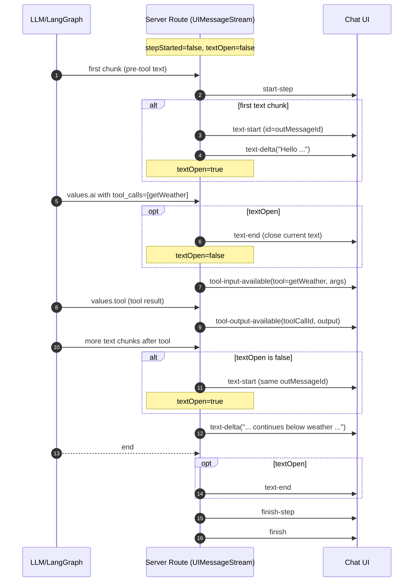

# Stream Text Chunking With Tool Components

This note documents the ordering bug we observed when streaming AI text interleaved with tool components (e.g., Weather), the root cause, and the fix implemented in the server route.

## Problem

- Symptom: During streaming, UI showed
  - text
  - Weather component
  - subsequent text still appearing above the Weather component
- Expectation: subsequent text should render below the Weather component.

## Root Cause

- The server opened a single long-lived text block at the very first frame by emitting `text-start`, then streamed all `text-delta`s, and only emitted `text-end` at the end of the entire response.
- When tool events (e.g., `tool-getWeather`) arrived mid-stream, they were inserted while the same text block was still open. The UI continued appending new text into that same text block, so visually it looked like later text belonged to the earlier paragraph, rendering above the tool component.

## Fix Summary

Shift to segmented text blocks around tools:

- Before writing a tool component, close any open text block with `text-end`.
- Emit tool events.
- When the next text chunk arrives, if no text block is open, reopen one with `text-start`, then write `text-delta`.

This guarantees that any text rendered after a tool component appears visually below that component.

## Files Touched

- Server stream route: `app/(chat)/api/chat/route.ts`

## Implementation Details

Introduced two booleans to manage stream state:

- `stepStarted`: emit `start-step` only once per assistant message.
- `textOpen`: whether a text block is currently open (between `text-start` and `text-end`).

Key behaviors:

1) At the first incoming event, only emit `start-step` (do not auto-open a text block).

2) On tool-call start (`values` event with `type === 'ai'` and `tool_calls` present):
   - If `textOpen`, emit `text-end` and set `textOpen = false` before sending tool input events.

3) On tool output (`values` with `type === 'tool'`):
   - Emit `tool-output-available` (or `tool-output-error`). No change to `textOpen`.

4) On text chunk (`messages` with `AIMessageChunk`):
   - Extract `text` from `content` safely.
   - If non-empty and `!textOpen`, emit `text-start` and set `textOpen = true`.
   - Emit `text-delta` with the chunk.

5) On end (`end` event):
   - If `textOpen`, emit `text-end` and set `textOpen = false`.
   - Emit `finish-step` and `finish`.

Also included a minor safety fix in text parsing to reference `contentChunk` consistently.

## Pseudocode

```
let stepStarted = false;
let textOpen = false;
const outMessageId = generateUUID();

for await (const chunk of lgStream) {
  if (!stepStarted) { write({ type: 'start-step' }); stepStarted = true; }

  switch (chunk.event) {
    case 'values':
      const last = chunk.data.messages.at(-1);
      if (last.type === 'ai' && last.tool_calls?.length) {
        if (textOpen) { write({ id: outMessageId, type: 'text-end' }); textOpen = false; }
        // write tool-input-available ...
      }
      if (last.type === 'tool') {
        // write tool-output-available | tool-output-error ...
      }
      break;

    case 'messages':
      // extract text from AIMessageChunk
      if (text?.length) {
        if (!textOpen) { write({ id: outMessageId, type: 'text-start' }); textOpen = true; }
        write({ id: outMessageId, type: 'text-delta', delta: text });
      }
      break;

    case 'end':
      if (textOpen) { write({ id: outMessageId, type: 'text-end' }); textOpen = false; }
      write({ type: 'finish-step' });
      write({ type: 'finish' });
      break;
  }
}
```

## Validation Steps

1) Trigger a chat where the model calls `getWeather`:
   - Expected render: text (part 1) → Weather component → text (part 2 below the component).

2) Observe server logs:
   - Just before the tool input is written, a `text-end` is logged/emitted when `textOpen` is true.
   - After the tool component, upon the first text delta, a `text-start` is emitted again.

3) Ensure every `text-start` has a corresponding `text-end` at `end`.

## Notes and Pitfalls

- Keep `outMessageId` stable across all text events belonging to the same assistant message.
- Avoid opening a text block at step start; only open when actual text arrives. This prevents empty text blocks and simplifies ordering.
- If you emit multiple tool components in one answer, the same open-close logic will apply between each tool and the adjacent text.

## Optional UI Improvement

In `components/chat.tsx`, the current `onData` appender can drop the very first event when `dataStream` is initially empty:

```ts
onData: (dataPart) => {
  setDataStream((ds) => (ds ? [...ds, dataPart] : []));
},
```

Consider switching to the simpler and safer form:

```ts
onData: (dataPart) => {
  setDataStream((ds) => [...ds, dataPart]);
},
```

This change is not required for the ordering fix but can make the stream handling more robust.

## Sequence Diagram

Below is a simplified sequence showing how text and a tool component (Weather) interleave after the fix. The key is to close a text block before tool rendering, and reopen it afterwards for subsequent text.



### Multiple tools in one answer

If multiple tools are invoked, apply the same pattern for each:

1) If `textOpen`, emit `text-end` before a tool call.
2) Emit tool input/output events.
3) On next text chunk, if `!textOpen`, emit `text-start` and continue with `text-delta`s.

