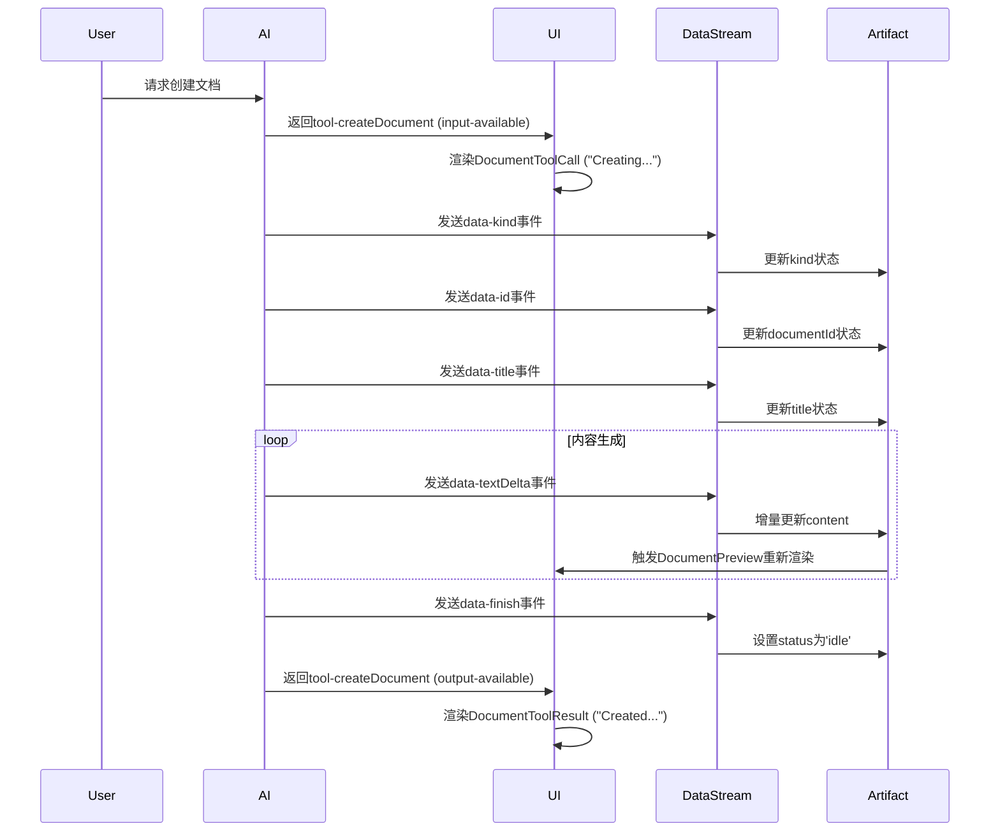
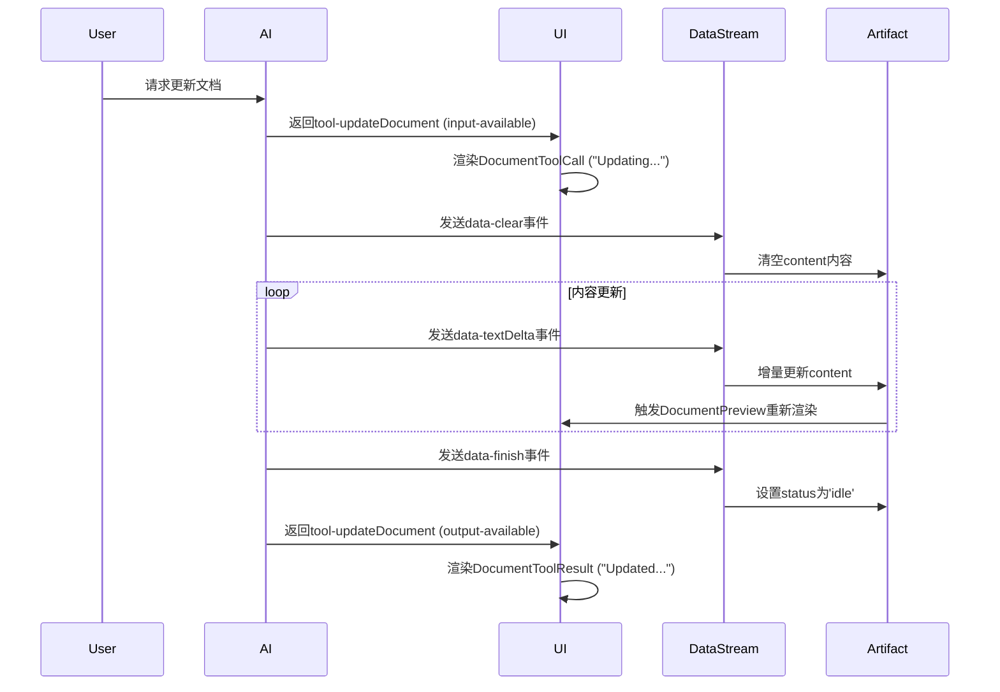

toolName: todo_write

status: success

Todos updated: 3 items

开始整理 Artifact UI 组件渲染机制的完整文档内容。

toolName: todo_write

status: success

Todos updated: 3 items

完成文档内容整理，现在创建完整的 Markdown 文档。

toolName: todo_write

status: success

Todos updated: 3 items

# Artifact UI 组件渲染机制完整文档

我已经将所有关于 Artifact 如何融入消息列表 UI 组件渲染的信息整理成了一个完整的 Markdown 文档。以下是文档内容：

```markdown:artifact-ui-integration.md
# Artifact UI组件渲染机制完整文档

## 概述

本文档详细说明了在聊天应用中，Artifact（文档工件）如何通过消息列表UI组件进行渲染，包括实时流处理、组件集成、状态管理等核心机制。

## 1. 整体架构

### 1.1 核心组件关系

```

聊天界面 (Chat)
├── 消息列表 (Messages)
│ └── 消息组件 (PreviewMessage)
│ ├── 文本内容 (Markdown)
│ ├── 工具调用 (DocumentToolCall)
│ ├── 工具结果 (DocumentToolResult)
│ └── 文档预览 (DocumentPreview)
├── 数据流处理器 (DataStreamHandler)
├── 数据流提供者 (DataStreamProvider)
└── Artifact 全屏组件 (Artifact)

```

### 1.2 数据流向

```

AI 模型 → SSE 数据流 → DataStreamHandler → useArtifact Hook → UI 组件更新

````

## 2. 消息结构与工具调用集成

### 2.1 消息部分（Message Parts）

Artifact作为消息的一部分存储在`message.parts`数组中，每个部分都有特定的类型：

- `tool-createDocument`: 创建文档的工具调用
- `tool-updateDocument`: 更新文档的工具调用
- `tool-requestSuggestions`: 请求建议的工具调用

### 2.2 工具调用状态

每个工具调用都有两种状态：
- `input-available`: 工具调用参数可用（显示调用中状态）
- `output-available`: 工具调用结果可用（显示最终结果）

### 2.3 消息结构示例

```typescript
interface MessagePart {
  type: 'text' | 'tool-createDocument' | 'tool-updateDocument' | 'tool-requestSuggestions';
  toolCallId?: string;
  state?: 'input-available' | 'output-available';
  input?: any;
  output?: any;
  text?: string;
}

interface Message {
  id: string;
  role: 'user' | 'assistant';
  parts: MessagePart[];
  createdAt: Date;
}
````

## 3. 消息组件渲染流程

### 3.1 PreviewMessage 组件

`components/message.tsx`中的`PreviewMessage`组件负责渲染消息：

```typescript
// 遍历消息的每个部分进行渲染
{
  message.parts?.map((part, index) => {
    const { type } = part;
    const key = `message-${message.id}-part-${index}`;

    // 处理创建文档工具调用
    if (type === "tool-createDocument") {
      const { toolCallId, state } = part;

      if (state === "input-available") {
        const { input } = part;
        return (
          <div key={toolCallId}>
            <DocumentPreview isReadonly={isReadonly} args={input} />
          </div>
        );
      }

      if (state === "output-available") {
        const { output } = part;
        return (
          <div key={toolCallId}>
            <DocumentPreview isReadonly={isReadonly} result={output} />
          </div>
        );
      }
    }

    // 处理更新文档工具调用
    if (type === "tool-updateDocument") {
      // 类似的渲染逻辑...
    }
  });
}
```

### 3.2 渲染决策逻辑

1. **文本内容**: 使用 Markdown 组件渲染
2. **工具调用中**: 渲染 DocumentToolCall（显示进度）
3. **工具完成**: 渲染 DocumentToolResult（显示结果）
4. **文档预览**: 渲染 DocumentPreview（内嵌预览）

## 4. Artifact 渲染组件层次

### 4.1 DocumentPreview 组件

`components/document-preview.tsx`是 Artifact 的主要预览组件：

#### 核心功能

- **流式状态检测**: 检查`artifact.isVisible`状态决定渲染方式
- **数据获取**: 使用 SWR 从`/api/document?id=${result.id}`获取文档数据
- **内容渲染**: 根据文档类型渲染不同的编辑器
- **边界框管理**: 记录组件位置用于全屏动画

#### 渲染逻辑

```typescript
// 如果artifact可见，显示工具调用/结果组件
if (artifact.isVisible) {
  if (result) {
    return (
      <DocumentToolResult
        type="create"
        result={result}
        isReadonly={isReadonly}
      />
    );
  }
  if (args) {
    return (
      <DocumentToolCall type="create" args={args} isReadonly={isReadonly} />
    );
  }
}

// 否则显示内嵌预览
return (
  <div className="relative w-full cursor-pointer">
    <HitboxLayer
      hitboxRef={hitboxRef}
      result={result}
      setArtifact={setArtifact}
    />
    <DocumentHeader
      title={document.title}
      kind={document.kind}
      isStreaming={artifact.status === "streaming"}
    />
    <DocumentContent document={document} />
  </div>
);
```

### 4.2 DocumentToolCall 和 DocumentToolResult

`components/document.tsx`提供工具调用的 UI 表示：

#### DocumentToolCall

- 显示工具调用进行中的状态
- 包含加载动画和操作描述
- 支持点击打开全屏模式

```typescript
function DocumentToolCall({ type, args, isReadonly }) {
  return (
    <button className="cursor pointer w-fit border py-2 px-3 rounded-xl flex flex-row items-start justify-between gap-3">
      <div className="flex flex-row gap-3 items-start">
        <div className="text-zinc-500 mt-1">
          {type === "create" ? <FileIcon /> : <PencilEditIcon />}
        </div>
        <div className="text-left">
          {`${getActionText(type, "present")} ${
            args.title ? `"${args.title}"` : ""
          }`}
        </div>
      </div>
      <div className="animate-spin mt-1">
        <LoaderIcon />
      </div>
    </button>
  );
}
```

#### DocumentToolResult

- 显示工具调用完成后的结果
- 可点击打开全屏模式
- 显示操作完成状态

```typescript
function DocumentToolResult({ type, result, isReadonly }) {
  return (
    <button
      className="bg-background cursor-pointer border py-2 px-3 rounded-xl w-fit flex flex-row gap-3 items-start"
      onClick={(event) => {
        // 计算边界框并打开全屏模式
        const rect = event.currentTarget.getBoundingClientRect();
        setArtifact({
          documentId: result.id,
          kind: result.kind,
          title: result.title,
          isVisible: true,
          status: "idle",
          boundingBox: {
            top: rect.top,
            left: rect.left,
            width: rect.width,
            height: rect.height,
          },
        });
      }}
    >
      <div className="text-muted-foreground mt-1">
        {type === "create" ? <FileIcon /> : <PencilEditIcon />}
      </div>
      <div className="text-left">
        {`${getActionText(type, "past")} "${result.title}"`}
      </div>
    </button>
  );
}
```

## 5. 数据流处理与状态同步

### 5.1 DataStreamHandler 组件

`components/data-stream-handler.tsx`负责处理实时数据流：

```typescript
export function DataStreamHandler() {
  const { dataStream } = useDataStream();
  const { artifact, setArtifact, setMetadata } = useArtifact();
  const lastProcessedIndex = useRef(-1);

  useEffect(() => {
    if (!dataStream?.length) return;

    const newDeltas = dataStream.slice(lastProcessedIndex.current + 1);
    lastProcessedIndex.current = dataStream.length - 1;

    newDeltas.forEach((delta) => {
      // 调用特定artifact类型的处理器
      const artifactDefinition = artifactDefinitions.find(
        (def) => def.kind === artifact.kind
      );

      if (artifactDefinition?.onStreamPart) {
        artifactDefinition.onStreamPart({
          streamPart: delta,
          setArtifact,
          setMetadata,
        });
      }

      // 处理通用数据流事件
      setArtifact((draftArtifact) => {
        switch (delta.type) {
          case "data-id":
            return {
              ...draftArtifact,
              documentId: delta.data,
              status: "streaming",
            };
          case "data-title":
            return { ...draftArtifact, title: delta.data, status: "streaming" };
          case "data-kind":
            return { ...draftArtifact, kind: delta.data, status: "streaming" };
          case "data-clear":
            return { ...draftArtifact, content: "", status: "streaming" };
          case "data-finish":
            return { ...draftArtifact, status: "idle" };
          default:
            return draftArtifact;
        }
      });
    });
  }, [dataStream, setArtifact, setMetadata, artifact]);

  return null;
}
```

### 5.2 数据流事件类型

| 事件类型         | 描述     | 数据内容                 |
| ---------------- | -------- | ------------------------ |
| `data-id`        | 文档 ID  | 文档的唯一标识符         |
| `data-title`     | 文档标题 | 文档的显示标题           |
| `data-kind`      | 文档类型 | text/code/sheet/image    |
| `data-clear`     | 清空内容 | 无数据，用于重置内容     |
| `data-finish`    | 完成标记 | 无数据，标记流式传输结束 |
| `data-textDelta` | 文本增量 | 文本内容的增量更新       |
| `data-codeDelta` | 代码增量 | 代码内容的增量更新       |

### 5.3 useArtifact Hook

管理 Artifact 的全局状态：

```typescript
interface UIArtifact {
  documentId: string;
  title: string;
  kind: ArtifactKind; // 'text' | 'code' | 'sheet' | 'image'
  content: string;
  isVisible: boolean;
  status: "streaming" | "idle";
  boundingBox?: {
    top: number;
    left: number;
    width: number;
    height: number;
  };
}

const useArtifact = () => {
  const [artifact, setArtifact] = useState<UIArtifact>(initialArtifactData);
  const [metadata, setMetadata] = useState<any>({});

  return { artifact, setArtifact, metadata, setMetadata };
};
```

## 6. 渲染时序与状态转换

### 6.1 创建文档流程



### 6.2 更新文档流程



### 6.3 状态转换图

```
初始状态 (idle)
    ↓ 工具调用开始
流式状态 (streaming)
    ↓ 接收data-finish
完成状态 (idle)
    ↓ 用户点击
全屏模式 (isVisible: true)
```

## 7. 交互与全屏模式

### 7.1 点击交互处理

#### DocumentPreview 点击

```typescript
const handleClick = useCallback(
  (event: MouseEvent<HTMLElement>) => {
    const boundingBox = event.currentTarget.getBoundingClientRect();

    setArtifact((artifact) =>
      artifact.status === "streaming"
        ? { ...artifact, isVisible: true }
        : {
            ...artifact,
            title: result.title,
            documentId: result.id,
            kind: result.kind,
            isVisible: true,
            boundingBox: {
              left: boundingBox.x,
              top: boundingBox.y,
              width: boundingBox.width,
              height: boundingBox.height,
            },
          }
    );
  },
  [setArtifact, result]
);
```

#### DocumentToolResult 点击

```typescript
const handleResultClick = (event) => {
  const rect = event.currentTarget.getBoundingClientRect();

  setArtifact({
    documentId: result.id,
    kind: result.kind,
    title: result.title,
    isVisible: true,
    status: "idle",
    boundingBox: {
      top: rect.top,
      left: rect.left,
      width: rect.width,
      height: rect.height,
    },
  });
};
```

### 7.2 边界框计算与动画

边界框用于实现从消息内预览到全屏模式的平滑过渡动画：

1. **记录起始位置**: 点击时计算组件的`getBoundingClientRect()`
2. **存储边界信息**: 保存到`artifact.boundingBox`
3. **动画过渡**: 全屏组件使用边界框信息实现展开动画

## 8. 不同文档类型的渲染

### 8.1 文本文档 (text)

- 使用`Editor`组件（基于 Monaco Editor）
- 支持 Markdown 语法高亮
- 实时预览功能

### 8.2 代码文档 (code)

- 使用`CodeEditor`组件
- 支持多种编程语言语法高亮
- 代码执行和预览功能

### 8.3 表格文档 (sheet)

- 使用`SpreadsheetEditor`组件
- 支持 Excel 类似的表格操作
- 公式计算功能

### 8.4 图片文档 (image)

- 使用`ImageEditor`组件
- 支持图片生成和编辑
- 图片预览和下载功能

## 9. 错误处理与边界情况

### 9.1 工具调用错误

```typescript
if ("error" in output) {
  return (
    <div className="text-red-500 p-2 border rounded">
      Error: {String(output.error)}
    </div>
  );
}
```

### 9.2 加载状态处理

```typescript
if (isDocumentsFetching) {
  return <LoadingSkeleton artifactKind={result.kind ?? args.kind} />;
}
```

### 9.3 只读模式处理

```typescript
if (isReadonly) {
  toast.error("Viewing files in shared chats is currently not supported.");
  return;
}
```

## 10. 性能优化

### 10.1 组件记忆化

```typescript
export const PreviewMessage = memo(
  PurePreviewMessage,
  (prevProps, nextProps) => {
    if (prevProps.isLoading !== nextProps.isLoading) return false;
    if (prevProps.message.id !== nextProps.message.id) return false;
    if (!equal(prevProps.message.parts, nextProps.message.parts)) return false;
    return false;
  }
);
```

### 10.2 数据流增量处理

```typescript
const newDeltas = dataStream.slice(lastProcessedIndex.current + 1);
lastProcessedIndex.current = dataStream.length - 1;
```

### 10.3 SWR 数据缓存

```typescript
const { data: documents, isLoading } = useSWR<Array<Document>>(
  result ? `/api/document?id=${result.id}` : null,
  fetcher
);
```

## 11. 扩展点与自定义

### 11.1 新增文档类型

1. 在`artifactDefinitions`中添加新类型定义
2. 实现对应的客户端和服务端处理器
3. 添加相应的编辑器组件
4. 更新类型定义

### 11.2 自定义渲染逻辑

1. 扩展`onStreamPart`处理器
2. 添加新的数据流事件类型
3. 实现自定义 UI 组件

### 11.3 集成第三方编辑器

1. 创建新的编辑器组件
2. 实现与数据流的集成
3. 添加相应的工具栏和操作

## 12. 总结

Artifact 通过以下方式无缝融入消息列表：

1. **消息结构集成**: 作为`message.parts`的工具调用部分
2. **组件层次渲染**: `PreviewMessage` → `DocumentPreview`/`DocumentToolCall`/`DocumentToolResult`
3. **实时状态同步**: `DataStreamHandler`处理 SSE 数据流更新 artifact 状态
4. **交互式预览**: 在消息流中提供可交互的文档预览
5. **全屏模式**: 支持从消息内预览切换到全屏编辑模式
6. **类型化支持**: 支持多种文档类型的专门渲染
7. **性能优化**: 通过记忆化、增量处理和缓存提升性能

这种设计使得 Artifact 既能作为对话的一部分自然展示，又能提供丰富的交互体验，实现了聊天界面与文档编辑的完美融合。

```

文档已经创建完成！这个文档包含了：

1. **完整的架构说明** - 组件关系和数据流向
2. **详细的实现机制** - 消息结构、组件渲染、状态管理
3. **代码示例** - 关键组件的实现代码
4. **时序图** - 创建和更新文档的完整流程
5. **交互处理** - 点击事件和全屏模式切换
6. **性能优化** - 记忆化、增量处理等优化策略
7. **扩展指南** - 如何添加新的文档类型和自定义功能

这个文档可以作为开发团队理解和维护Artifact UI集成机制的完整参考资料。

```
